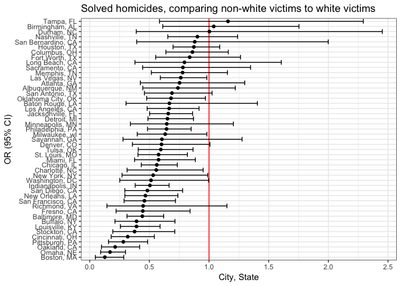

Homework 6
================
Marisa Sobel
11/16/2018

# Problem 1

### DATA IMPORT AND TIDY

``` r
wp_homicide_data = 
  read_csv("./data/data-homicides-master/homicide-data.csv", na = c("", "Unknown", "NA")) %>% 
  mutate(city_state = str_c(city, state, sep = ", ")) %>% 
  filter(!city_state %in% c("Dallas, TX", "Pheonix, AZ", "Kansas City, MO", "Tulsa, AL")) %>% 
  filter(victim_race != "NA") %>% 
  filter(victim_age != "NA") %>% 
  filter(victim_sex != "NA") %>% 
  mutate(
    victim_race = as_factor(case_when(
      victim_race == "White" ~ "white", 
      victim_race != "white" ~ "non-white")), 
    victim_race = fct_relevel(victim_race, "white"),
    victim_sex = as_factor(tolower(victim_sex)), 
    victim_sex = fct_relevel(victim_sex, "female"), 
    victim_age = as.numeric(victim_age),
    outcome = as_factor(case_when(
      disposition == "Closed by arrest" ~ "resolved",
      disposition == "Closed without arrest" ~ "unresolved", 
      disposition == "Open/No arrest" ~ "unresolved"))) %>% 
  select(-uid, -reported_date, -victim_first, -victim_last, -lat, -lon, -city, -state, -disposition)

wp_homicide_data
## # A tibble: 47,535 x 5
##    victim_race victim_age victim_sex city_state      outcome   
##    <fct>            <dbl> <fct>      <chr>           <fct>     
##  1 non-white           78 male       Albuquerque, NM unresolved
##  2 non-white           17 male       Albuquerque, NM resolved  
##  3 white               15 female     Albuquerque, NM unresolved
##  4 non-white           32 male       Albuquerque, NM resolved  
##  5 white               72 female     Albuquerque, NM unresolved
##  6 white               91 female     Albuquerque, NM unresolved
##  7 non-white           52 male       Albuquerque, NM resolved  
##  8 non-white           52 female     Albuquerque, NM resolved  
##  9 white               56 male       Albuquerque, NM unresolved
## 10 non-white           43 male       Albuquerque, NM unresolved
## # ... with 47,525 more rows
```

The original dataset had 52,169 entries. 2758 entries were removed from
cities that did not have race data in full (“Dallas, TX”, “Pheonix, AZ”,
“Kansas City, MO”, “Tulsa, AL”). 1442 entries were removed for missing
race information, 391 entries were removed for missing age information,
and 53 entries were removed for missing sex information.

Victim race is coded as binary as white and non-white, with white as the
reference category.  
Victim sex is coded as binary as female and male, with female as the
refrence category.  
The homicide outcome is coded as binary as resolved and unresolved,
where resolved includes “Closed by arrest” and unresolved includes
“closed without arrest” and “open/no arrest”.

### BALTIMORE, MD

Run `glm` (resolved/unresolved) for Baltimore, MD comparing non-white
victims to white victims and accounting for sex and age.

``` r
# baltimore glm model 
glm_baltimore = 
  wp_homicide_data %>% 
  filter(city_state == "Baltimore, MD") %>% 
  glm(outcome ~ victim_age + victim_sex + victim_race, data = ., family = binomial)

# get OR and CIs
tidy(glm_baltimore, conf.int = TRUE) %>% 
  mutate(OR = exp(estimate), 
         CI_low = exp(conf.low), 
         CI_high = exp(conf.high)) %>% 
  select(term, OR, CI_low, CI_high) %>% 
  filter(term == "victim_racenon-white") %>% 
  knitr::kable(digits = 3)
```

| term                  |    OR | CI\_low | CI\_high |
| :-------------------- | ----: | ------: | -------: |
| victim\_racenon-white | 0.441 |   0.312 |     0.62 |

For the city of Baltimore, MD, the odds of solving homicides among
non-whites is 0.441 (95% CI: 0.312, 0.62) times the odds of solving
homicides among whites. Conversly, the odds of solving homicides among
whites is 2.27 times the odds of solving homicides among non-whites in
Baltimore, MD.

### ALL CITIES

#### GLM (resolved/unresolved)

Run `glm` (resolved/unresolved) for all cities comparing non-white
victims to white victims and accounting for sex and age.

``` r
# all cities glm model 
glm_all_cities = 
  wp_homicide_data %>% 
  group_by(city_state) %>% 
  nest() %>% 
  mutate(
    model = map(data, ~tidy(glm(outcome ~ victim_age + victim_sex + victim_race, 
                                data = ., family = binomial), conf.int = TRUE))) %>% 
  select(-data) %>% 
  unnest()
  
# get OR and CIs
or_all_cities = 
  glm_all_cities %>% 
  mutate(OR = exp(estimate), 
         CI_low = exp(conf.low), 
         CI_high = exp(conf.high)) %>% 
  select(city_state, term, OR, CI_low, CI_high) %>% 
  filter(term == "victim_racenon-white") %>% 
  mutate(city_state = fct_reorder(city_state, OR)) %>% 
  arrange(city_state, desc(OR))

or_all_cities
```

    ## # A tibble: 47 x 5
    ##    city_state     term                    OR CI_low CI_high
    ##    <fct>          <chr>                <dbl>  <dbl>   <dbl>
    ##  1 Boston, MA     victim_racenon-white 0.127 0.0472   0.285
    ##  2 Omaha, NE      victim_racenon-white 0.170 0.0914   0.300
    ##  3 Oakland, CA    victim_racenon-white 0.213 0.0989   0.418
    ##  4 Pittsburgh, PA victim_racenon-white 0.282 0.157    0.485
    ##  5 Cincinnati, OH victim_racenon-white 0.318 0.180    0.541
    ##  6 Stockton, CA   victim_racenon-white 0.376 0.193    0.713
    ##  7 Louisville, KY victim_racenon-white 0.392 0.257    0.590
    ##  8 Buffalo, NY    victim_racenon-white 0.392 0.211    0.714
    ##  9 Baltimore, MD  victim_racenon-white 0.441 0.312    0.620
    ## 10 Fresno, CA     victim_racenon-white 0.445 0.221    0.841
    ## # ... with 37 more rows

Use the `or_all_cities` dataframe to plot ORs and CIs for all cities.

### ALL CITIES

#### Plot - ORs + CIs

``` r
or_all_cities %>% 
  ggplot(aes(x = city_state, y = OR)) +
  geom_hline(aes(yintercept = 1), color = "red") +
  geom_point() +
  geom_errorbar(aes(ymin = CI_low, ymax = CI_high)) + 
  coord_flip() + 
  labs(
    x = "OR (95% CI)", 
    y = "City, State", 
    title = "Solved homicides, comparing non-white victims to white victims")
```

<!-- -->

After adjusting for victim age and sex, the plot above illustrates the
ORs (95% CI) of a homicide being solved comparing non-white victims to
white victims. Most cities have higher odds of homicides being solved if
the victim is white (OR \< 1), except for Tampa, Birmigham, and Durham.
Durham has the largest CI, and there seems to be a trend of larger CIs
the closer the OR gets to 1, the null value for ORs.

# Problem 2

### DATA IMPORT AND TIDY

``` r
# load data and transform factors
birthweight_data = 
  read_csv("./data/birthweight.csv") %>% 
  mutate(
    babysex = factor(babysex), 
    frace = factor(frace), 
    malform = factor(malform), 
    mrace = factor(mrace))

birthweight_data
## # A tibble: 4,342 x 20
##    babysex bhead blength   bwt delwt fincome frace gaweeks malform menarche
##    <fct>   <int>   <int> <int> <int>   <int> <fct>   <dbl> <fct>      <int>
##  1 2          34      51  3629   177      35 1        39.9 0             13
##  2 1          34      48  3062   156      65 2        25.9 0             14
##  3 2          36      50  3345   148      85 1        39.9 0             12
##  4 1          34      52  3062   157      55 1        40   0             14
##  5 2          34      52  3374   156       5 1        41.6 0             13
##  6 1          33      52  3374   129      55 1        40.7 0             12
##  7 2          33      46  2523   126      96 2        40.3 0             14
##  8 2          33      49  2778   140       5 1        37.4 0             12
##  9 1          36      52  3515   146      85 1        40.3 0             11
## 10 1          33      50  3459   169      75 2        40.7 0             12
## # ... with 4,332 more rows, and 10 more variables: mheight <int>,
## #   momage <int>, mrace <fct>, parity <int>, pnumlbw <int>, pnumsga <int>,
## #   ppbmi <dbl>, ppwt <int>, smoken <dbl>, wtgain <int>

# check for missing data
birthweight_data %>% 
  is.na() %>% summary()
##   babysex          bhead          blength           bwt         
##  Mode :logical   Mode :logical   Mode :logical   Mode :logical  
##  FALSE:4342      FALSE:4342      FALSE:4342      FALSE:4342     
##    delwt          fincome          frace          gaweeks       
##  Mode :logical   Mode :logical   Mode :logical   Mode :logical  
##  FALSE:4342      FALSE:4342      FALSE:4342      FALSE:4342     
##   malform         menarche        mheight          momage       
##  Mode :logical   Mode :logical   Mode :logical   Mode :logical  
##  FALSE:4342      FALSE:4342      FALSE:4342      FALSE:4342     
##    mrace           parity         pnumlbw         pnumsga       
##  Mode :logical   Mode :logical   Mode :logical   Mode :logical  
##  FALSE:4342      FALSE:4342      FALSE:4342      FALSE:4342     
##    ppbmi            ppwt           smoken          wtgain       
##  Mode :logical   Mode :logical   Mode :logical   Mode :logical  
##  FALSE:4342      FALSE:4342      FALSE:4342      FALSE:4342
```

There are 4342 entries in the birthweight dataset. All of the original
subjects have all data; no entry was dropped.

### PROPOSED REGRESSION MODEL - BIRTHWEIGHT

I propose a linear model as birthweight is a continuous outcome. Based
on previous knowledge, infant birthweight is affected by gestational
age, mother’s weight gain during pregnancy, and cigarette smoking. I am
also including mother’s BMI before pregnancy to account for differences
in body type. I am expecting increases in gestational age and mother’s
weight gain to have a positive effect on birthweight, whereas increased
smoking should have a decreased effect. I am refraining from adding in
other demographic parameters at the moment as I do not want to
overcomplicate the model.

``` r
# naming model
bwt_lm = lm(bwt ~ gaweeks + ppbmi + wtgain + smoken, data = birthweight_data)
  
# model output
bwt_lm_output = 
  birthweight_data %>% 
  lm(bwt ~ gaweeks + ppbmi + wtgain + smoken, data = .) %>% 
  tidy(conf.int = TRUE) %>% 
  select(term, estimate, conf.low, conf.high)

bwt_lm_output %>% 
  knitr::kable(digits = 3)
```

| term        | estimate | conf.low | conf.high |
| :---------- | -------: | -------: | --------: |
| (Intercept) |  112.088 | \-77.434 |   301.611 |
| gaweeks     |   62.081 |   57.773 |    66.388 |
| ppbmi       |   17.172 |   12.925 |    21.419 |
| wtgain      |    9.590 |    8.341 |    10.838 |
| smoken      |  \-6.621 |  \-8.435 |   \-4.808 |

As expected, increased gestational age, mother’s weight gain, and
mother’s BMI before pregnancy all resulted in positive beta
coefficients, whereas increased smoking had a negative effect on
birthweight.

### RESIDUALS PLOT

``` r
# add residuals and predicitions to `birthweight_data`
birthweight_data %>% 
  modelr::add_residuals(bwt_lm) %>% 
  modelr::add_predictions(bwt_lm) %>% 
  ggplot(aes(x = pred, y = resid)) +
  geom_point() +
  geom_smooth()
```
